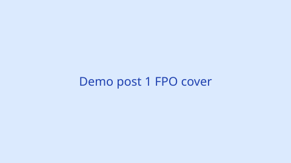

This post lives in a **leaf bundle**: `content/blog/demo-post-1/index.md` plus files in the same folder (for example `cover.svg`). The public URL is **`/blog/demo-post-1/`** from the folder name; you could override that with `slug:` in front matter if you wanted a different last segment.



This paragraph is only for a short automatic summary if you add a `<!--more-->` marker after the intro line in a longer article.

<!--more-->

## FPO section heading

1. Categories and tags drive taxonomy pages such as `/categories/notes/` and `/tags/hugo/`.
2. Those lists are generated by Hugo from your front matter, not from a hand-maintained list in the config.
3. The “archive” at `/blog/` is this section’s `_index.md` body plus Hugo’s `.Pages` list (see `layouts/section.html`).
