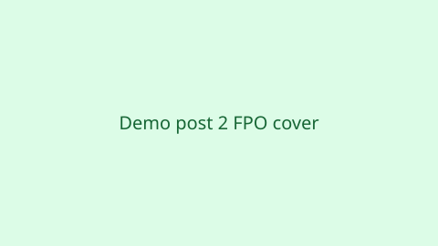

The front matter sets **`slug: demo-post-2`**, which matches this folder name anyway — if you changed it to another slug, the URL’s last segment would follow `slug` instead of the folder name.



<!--more-->

## Shared metadata

This post shares **Notes** and the tag **hugo** with demo post 1 so the generated taxonomy pages list more than one article. **Product** appears only here for variety.
